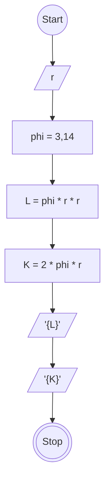

# Javascript

## Flowchart

Flowchart Luas dan Keliling Lingkaran

```mermaid

    flowchart TD

    a@{ shape: circle, label: "Start" }
    b@{ shape: lean-r, label: "r" }
    c@{ shape: rect, label: "phi = 3,14" }
    d@{ shape: rect, label: "L = phi * r * r" }
    e@{ shape: rect, label: "K = 2 * phi * r" }
    f@{ shape: lean-r, label: "'{L}'" }
    g@{ shape: lean-r, label: "'{K}'" }
    h@{ shape: dbl-circ, label: "Stop" }

    a --> b --> c --> d --> e --> f --> g --> h
```
