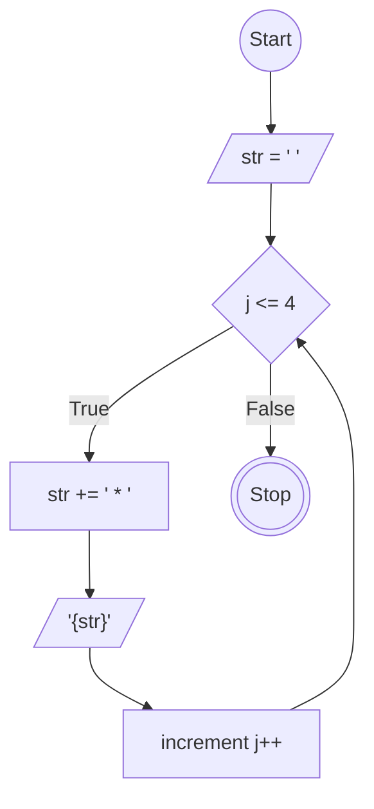

# Javascript

## Flowchart

Membuat flowchar dari program Perulangan yang menghasilkan segitiga siku-siku

```mermaid

    flowchart TD

    a@{ shape: circle, label: "Start" }
    b@{ shape: lean-r, label: " str = ' '" }
    d@{ shape: diamond, label: "j <= 4" }
    e@{ shape: rect, label: " str += ' * '" }
    g@{ shape: lean-r, label: " '{str}'" }
    f@{ shape: rect, label: " increment j++" }

    h@{ shape: dbl-circ, label: "Stop" }

    a --> b --> d

    d --True--> e --> g --> f
    f --> d

    d --False--> h
```
